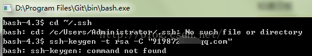
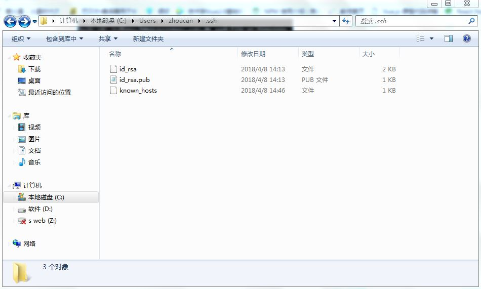

# Git生成公钥报错：“bash:ssh-keygen command not found”

>  公钥是CODE识别您的用户身份的一种认证方式，通过公钥，您可以将本地git项目与CODE建立联系，然后您就可以很方便的将本地代码上传到CODE，或者将CODE代码下载到本地了。

   

## 问题解决方案一：

 以下介绍生成公钥和管理公钥的方法。如果你是在windows系统下使用，需要先安装git的windows客户端[msysgit](http://code.google.com/p/msysgit) , 然后运行 Git Bash, 在弹出的终端中输入下面提示的代码。

* 1 生成公钥

  * 首先检查本机公钥：

  ```
  $ cd ~/.ssh
  ```

  * 如果提示：No such file or directory 说明你是第一次使用git。如果不是第一次使用，请执行下面的操作,清理原有ssh密钥。

  ```
  $ mkdir key_backup
  $ cp id_rsa* key_backup
  $ rm id_rsa*
  ```

* 2 生成新的密钥：

  * 输入生成密钥指令

  ```
  $ ssh-keygen -t rsa -C “您的邮箱地址”
  ```

  * 说明：在回车中会提示你输入一个密码，这个密码会在你提交项目时使用，如果为空的话提交项目时则不用输入。

    您可以在你本机系统盘下，您的用户文件夹里发现一个.ssh文件，其中的id_rsa.pub文件里储存的即为刚刚生成的ssh密钥。

* 3 添加公钥

  * 登录CODE平台，进入用户“账户设置”，点击右侧栏的“ssh公钥管理”，点击“添加公钥”，将刚刚生成的公钥填写到“公钥”栏，并为它起一个名称，保存即可。
  * 注意：复制公钥时不要复制多余的空格，否则可能添加不成功。

* 4 管理公钥

  *  您也可以在“账户设置”——“ssh公钥管理”删除或者修改公钥。

<--------------------------------------------------------------------END------------------------------------------------------------------------------>

## 问题解决方案二：

* 在生成新的密钥过程中，有时会报错：  bash:ssh-key command not found

​                                        

* 解决办法很简单，输入 $export PATH=/usr/bin:$PATH ，设置path变量。
* 完成之后设置文件储存位置，设置密码，ok。
* 在C:\Users\zhoucan\.ssh目录下，id_rsa.pub就是生成的公钥，用记事本打开就可以用了：                                                                                                         

